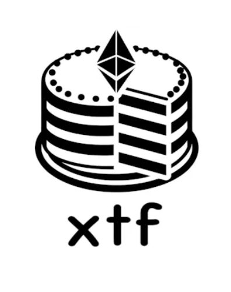

# XTF Dexes (On chain Indexes)


## Inspiration

In the last Chainlink hackathon (Constellation), we introduced [XTF](https://devpost.com/software/xtf), a multichain ETF platform that allows users to bundle assets across multiple chains and sell shares of these bundles. 
The feedback was received was positve, validating the potential and demand for decentralized index funds that operate on multiple networks. 

However, one recurring concern from the community was the centralization risk associated with how the indexes were determined and managed. The process for selecting and weighing the assets within these indexes was unclear and relied on trusted third parties. This raised valid concerns about potential collusion and the reliability of the index compositions.

Taking this feedback to heart, we went on a mission to enhance the decentralization of XTF by developing a robust, transparent, and decentralized mechanism for index selection and weighting.

We were mainly by the reliability and security of the [Decentralised Data Model](https://docs.chain.link/architecture-overview/architecture-decentralized-model?parent=dataFeeds) of Chainlink’s price oracles, which aggregate data from multiple sources and use advanced techniques to detect and exclude outliers, we aimed to apply similar principles to our index determination process.


## What it does

We proposed three methods to address the reliability and collusion concerns:

1. **TLS Oracles**: Leveraging TLS oracles to independently verify the contents of web pages at a specific time that shows crypto indexes, creating cryptographic proofs of index data from trusted sources. 
2. **Multi-Attestation Protocols**: Using ETHSign to create multi-signature attestation indexes approved by many trusted entities, ensuring consensus and reducing the risk of manipulation.
3. **Oracle data and on-chain Aggregator**:  A smart contract that periodically pulls price, supply, liquidity, and other on-chain data to calculate metrics like market capitalization. It includes a bribing system to reward users for triggering data collection functions within specified timeframes, ensuring data integrity and freshness.

### TLS Oracles and zk Proofs

We found that Chainlink is working on a [DECO](https://blog.chain.link/deco-introduction/) implementation for RWAs and for this reason, we initially planned to implement TLS oracles to create zk proofs on TLS messages and obtain index results from trusted pages. 
However, we discovered that the [chacha20 Circom circuit](https://github.com/reclaimprotocol/circom-chacha20) we were using was implemented by the [Reclaim Protocol](https://www.reclaimprotocol.org/), which had already built an app for creating TLS Zk Proofs through the [Reclaim app](https://apps.apple.com/in/app/reclaim-protocol/id6475267895).
This led us to use Reclaim to generate zk proofs for verifying that specific tokens were listed in the Defi Pulse index on the Forbes website.

(More info on how the Reclaim Protocol works and **its limitations** in the [whitepaper](https://docs.reclaimprotocol.org/whitepaper))

We implemented a Reclaim Datasource and app to select the data of interest on this Forbes page. 


We integrated the [Reclaim JS-SDK](https://www.npmjs.com/package/@reclaimprotocol/js-sdk?activeTab=readme) to interact with the app on our demo website, allowing us to trigger the creation of Reclaim oracle proxies and generate a QR code for the Reclaim mobile app. Since not all browsers support selecting specific ciphers and TLS configurations for security, we visited the page through the mobile app, which communicated with the oracles to produce ZK proofs. We then used the [Reclaim solidity libraries](https://www.npmjs.com/package/@reclaimprotocol/reclaim-sdk) in our index smart contract to verify the proof. Once validated, the contract persists the index and weights, making them available to XTF for creating a fund.

[DefiPulseIndexForbes.sol Contract](xtf/packages/hardhat/contracts/DefiPulseIndexForbes.sol)

``` JAVA
  function verifyProof(Reclaim.Proof memory proof, string memory tokenListParamsString) public {
      //Check the ZK proof
      Reclaim(reclaimAddress).verifyProof(proof);

      require(keccak256(abi.encodePacked(proof.claimInfo.parameters)) == keccak256(abi.encodePacked(tokenListParamsString)), "Invalid token list parameters");

      // parse the token List string into a list of strings
      string[] memory tokenList = split(tokenListParamsString);

      for(uint i = 0; i < tokenList.length; i++){
        require(tokenSymbolToAddress[tokenList[i]] != address(0), "Token not yet registered");
        defiPulseIndexForbes.push(tokenList[i]);
      }
      lastUpdateTimestamp = block.timestamp;
  }
```


### Multi-Attestation Protocols

We also found that some protocols in similar cases used external data signed by third parties using structured data [EIP-712](https://eips.ethereum.org/EIPS/eip-712) to verify the signatures. Inspired by this, we explored signing protocols to implement a more robust solution with multi-sig attestation. We found [ETHSign](https://www.ethsign.xyz/) particularly interesting as it allowed us to create even more structured data with schemas. We used those attestations for defining asset indexes and weights. We created a simple schema with an array of weights and addresses to be used by the index. These attestations function like a legal contract, they can be published, consumed, and revoked which proved to be a perfect web3 solution for this use case.


[AttestationEntities.sol Contract](xtf/packages/hardhat/contracts/AttestationEntities.sol)


```Java 
    function publishListofTokens(uint256[] memory _weights) public returns (uint64) {
        // require(signatures.length == trustedEntities.length, "All trusted entities must approve tokens");
        
        for (uint256 i = 0; i < proposedTokens.length; i++) {
            approvedAddresses.push(proposedTokens[i]._address);
        }
        
        Attestation memory attestation = Attestation({
            schemaId: schemaId,
            linkedAttestationId: 0,
            attestTimestamp: uint64(block.timestamp),
            revokeTimestamp: 0,
            attester: address(this),
            validUntil: 0,
            dataLocation: DataLocation.ONCHAIN,
            revoked: false,
            recipients: new bytes[](0),
            data: abi.encode(
                approvedAddresses,
                _weights
            )
        });

        lastAttestationId =  spInstance.attest(attestation, "", "", "");
        lastAttestationTimestamp = block.timestamp;
        return lastAttestationId;
    }
```

Note that while ETHSign currently supports in-depth data verification on specific chains, it can still communicate attestation results to any chain reachable through CCIP. This capability allows for running a fund based on an index across multiple chains.


### Oracle data and on-chain Aggregator

All the described solutions required entities to actively publish indexes, we focused on something that was secure and could be launched soon. We knew that most indexes are driven by prices and market cap, which is calculated by total supply times price.
For example, the Dow Jones is a [price-weighted index](https://www.financestrategists.com/wealth-management/stocks/price-weighted-index/), giving more influence to higher-priced stocks, while the S&P 500 is [market-cap-weighted](https://www.investopedia.com/terms/c/capitalizationweightedindex.asp), giving more influence to larger companies by market value.

By aggregating prices over a certain period using secure and reliable price oracles, and connecting this data to the supply of the tokens via a smart contract, we use similar methodologies to rank assets in indexes.


[IndexAggreagtor.sol Contract](xtf/packages/hardhat/contracts/IndexAggreagtor.sol#L224)

We use the `collectPriceFeeds` to collect prices (using Chanilnk AggregatorV3Interface we mocked here [MockPriceAggregator](xtf/packages/hardhat/contracts/MockAggregator.sol))

```JAVA

    function collectPriceFeeds() external {
        require(block.timestamp - lastSampleTime >= samplingFrequency, "IndexAggregator: Sampling frequency not reached");

        if (block.timestamp - lastSampleTime >= timeWindow) {
            for (uint256 i = 0; i < tokenInfo.length; i++) {
                if (movingAverage[i].length > 0) {
                    movingAverage[i].pop();
                }
            }
        }

        for (uint256 i = 0; i < tokenInfo.length; i++) {
            (, int256 answer, , , ) = AggregatorV3Interface(tokenInfo[i]._aggregator).latestRoundData();

            movingAverage[i].push(uint256(answer));
            uint256 sum = 0;
            if (movingAverage[i].length > sampleSize) {
                movingAverage[i].pop();
            }
            for (uint256 j = 0; j < movingAverage[i].length; j++) {
                sum += movingAverage[i][j];
            }
        }
        lastSampleTime = block.timestamp;
        // if there is enough bribe pay it to the caller
        if (bribeUnit > 0) {
            payable(msg.sender).transfer(bribeUnit);
        }
    }
 ```

#### Multi-chain data aggregation 

Some of this data is available on different chains, so we implemented a messaging system to inform a primary chain (mainchain) of secondary chain data. Every time we need to create an index based on market cap we need to make sure supply data are updated.

Note that for simplicity we are aware that we should aggregate also supply data within prices however it would be complicated to ensure supply data are in sync with price ones on different chains and for this reason we decided to get supply (and all chain data) only when we want to persist an index. So instead of having avg( ith-price*ith-supply))  we have avg(ith-prices) * last supply. In case of high standard deviation (or variance), this could lead to problems. 


[IndexAggreagtor.sol Contract](xtf/packages/hardhat/contracts/IndexAggreagtor.sol#L224)

We use the `collectPriceFeeds` to collect prices (using Chanilnk AggregatorV3Interface we mocked here [MockPriceAggregator](xtf/packages/hardhat/contracts/MockAggregator.sol))

```Java
    function _ccipReceive(
        Client.Any2EVMMessage memory message
    ) internal virtual override {

        IndexUpdateMessage memory indexMessage = abi.decode(
            message.data,
            (IndexUpdateMessage)
        );
        for (uint256 i = 0; i < indexMessage.liquidityMessages.length; i++) {
            LiquidityMessage memory liquidityMessage = indexMessage.liquidityMessages[i];
            liquidityMessages.push(liquidityMessage);
        }
        for (uint256 i = 0; i < indexMessage.supplyMessages.length; i++) {
            SupplyMessage memory supplyMessage = indexMessage.supplyMessages[i];
            supplyMessages.push(supplyMessage);
        }
    }
```

Note that we are not processing messages here as it could be too expensive and this could lead to failure.


We use the `updateTokenParams` to replay and process all the receveid messages on mainchain to update it with all the external (sidechain) (see the `isMainChain()` check).
The same method on `sidechain` is used to populate the outbox of messages that will be send to the `mainchain` using the `send` method ([IndexAggreagtor.sol Send](xtf/packages/hardhat/contracts/IndexAggreagtor.sol#332))

--

[IndexAggreagtor.sol updateTokenParams](xtf/packages/hardhat/contracts/IndexAggreagtor.sol#150)

```Java
    function updateTokenParams(uint256[] memory _totalSupplies, uint256[] memory _liquidities) external {

        for (uint256 i = 0; i < tokenInfo.length; i++) {
            if (tokenInfo[i]._chainId == chainId) {
                liquidities[i] = liquidityManager.getTotalLiquidityForToken(tokenInfo[i]._address);
                totalSupplies[i] = IERC20(tokenInfo[i]._address).totalSupply();
                tokenParamsTimestampUpdates[i] = block.timestamp;
            }
        }

        if(isMainChain()){
            for (uint256 i = 0; i < totalSupplies.length; i++) {
                for (uint256 j = 0; j < tokenInfo.length; j++) {
                    if (tokenInfo[j]._address == supplyMessages[i].token) {
                        totalSupplies[j] = supplyMessages[i].supply;
                        tokenParamsTimestampUpdates[j] = liquidityMessages[i].timestamp;
                    }
                    continue;
                }
            }

            for (uint256 i = 0; i < liquidities.length; i++) {
                for (uint256 j = 0; j < tokenInfo.length; j++) {
                    if (tokenInfo[j]._address == liquidityMessages[i].token) {
                        liquidities[j] = liquidityMessages[i].liquidity;
                        tokenParamsTimestampUpdates[j] = liquidityMessages[i].timestamp;
                    }
                    continue;
                }
            }
        }

        if(!isMainChain()){
            SupplyMessage[] memory _supplyMessages = new SupplyMessage[](tokenInfo.length);
            LiquidityMessage[] memory _liquidityMessages = new LiquidityMessage[](tokenInfo.length);
            for (uint256 i = 0; i < tokenInfo.length; i++) {
                if(chainId == tokenInfo[i]._chainId){
                    _supplyMessages[i] = SupplyMessage(tokenInfo[i]._address, _totalSupplies[i], chainId, block.timestamp);
                    _liquidityMessages[i] = LiquidityMessage(tokenInfo[i]._address, _liquidities[i], chainId, block.timestamp);
                }
            }
        }
    }
```


#### Other on-chain data and Liquidity 

We noted that other on-chain data can be used to enhance the index definition. For example, we could combine liquidity data from DEXes (like Uniswap, Compound, and 1inch) to decide which assets to include or exclude, filtering out assets with insufficient liquidity that would make it difficult to mint an XTF fund vault.
For this demo, we deployed a mock implementation of [UniswapV3](xtf/packages/hardhat/contracts/IUniswapV3Factory.sol) where liquidity is defined by how many times we could perform an exchange with a certain token. We pulled data from all Uniswap pools that included the token we were evaluating and some common reference tokens, such as USDC, USDT, and ETH. This approach gave us a metric telling us how easily we could swap common reference tokens for our selected token. 
We implemented a dedicated smart contract ([Liquidity Manager](xtf/packages/hardhat/contracts/LiquidityManager.sol)) to gather this information from all pools and make the liquidity metric available to our index aggregator. This allows us to filter out tokens with insufficient liquidity if necessary.

Contracts:
- [UniswapV3 Factory](xtf/packages/hardhat/contracts/IUniswapV3Factory.sol)
- [Mock UniswapV3 Entry Point](xtf/packages/hardhat/contracts/MockUniswapV3Factory.sol)
- [Mock UniswapV3 Pool](xtf/packages/hardhat/contracts/MockUniswapV3Pool.sol)
- [UniswapV3 Pool Deployer](xtf/packages/hardhat/contracts/IUniswapV3PoolDeployer.sol)


#### Bribing system

Because on-chain data (price from oracles, supplies, and liquidity) is all pulled by a contract manager, this could become problematic if the manager fails to trigger the data. We considered a cron-job and set a [Chainlink Upkeep](https://automation.chain.link/sepolia/85061725038261017415132553308856974146790069167102999642891143434013567824903) to enforce the price pull (collectPriceFeeds method) however we wanted to make sure the updated process did not rely on an entity only and we ultimately decided that the most secure way was to implement an incentive system to ensure data were updated. 

We implemented a bribing system where the index aggregator has funds and pays a certain amount to the first user who invokes the pull method within the required timeframe. 
Users can see the remaining funds and determine if there is enough runway to maintain a safe index.


#### Tagging assets

It is also worth noting that when we designed XTF, we envisioned experienced users who wanted to hedge their positions by depositing tokens and getting exposure to multiple assets in return. However, from user surveys and discussions, we found that XTF mainly attracts newcomers or people not well-versed in certain segments of crypto who want to invest there. 

From one of our surveys:

> You can’t be an expert in AI tokens, DeFi, memes, and NFTs all at once [...] these are different worlds and it’s already tough enough to find people who really, really get blockchain! 

For this reason, we needed to ensure that the index could also group assets by categories. We created a new Reclaim Protocol data provider for tagging assets by inspecting the content of CoinGecko’s description pages. We implemented a [Tagging contract Manager](xtf/packages/hardhat/contracts/TaggingVerifier.sol) that, once it verified Reclaim zk proofs, added tags to assets. Users can now persist not only the overall asset index but also by category, allowing them to invest in crypto segments where they may lack expertise.

[Tagging contract Manager -  verifyProof](xtf/packages/hardhat/contracts/TaggingVerifier.sol#L53)

```JAVA
  function verifyProof(Reclaim.Proof memory proof, string memory tokenSymbolTag) public {
      Reclaim(reclaimAddress).verifyProof(proof);
      require(keccak256(abi.encodePacked(proof.claimInfo.parameters)) == keccak256(abi.encodePacked(tokenSymbolTag)), "Invalid token list parameters");
      string[] memory stringList = split(tokenSymbolTag);    
      require(stringList.length == 2, "Invalid token list parameters");
      if (tokenSymbolToVerifiedTags[stringList[0]].length == 0) {
          tokenSymbolToVerifiedTags[stringList[0]] = new string[](0);
      }
      tokenSymbolToVerifiedTags[stringList[0]].push(stringList[1]);
      tokenSymbolToVerifiedTagsMap[stringList[0]][stringList[1]] = true;
      lastUpdateTimestamp = block.timestamp;
  }
  ```


Note that tagging assets can lead to collusion problems if tags are not secured or if only one entity is responsible for tagging. For simplicity, we decided this was the best solution for now. However, further consideration is needed to implement other systems, potentially based on anti-collusion votes from the DAO (e.g. using [MACI](https://maci.pse.dev/))

#### Mock Data

To simulate a full environment, we pulled data from CoinGecko over the last 30+ days, including token prices and liquidity. We stored this data in files and later used it to deploy to our smart contract (updating price data feeds and Unsiwap pool clones, mimicking a real environment.

All the mock data are available in the [coingecko root folder](coingecko) 
Here is [one of the scripts](coingecko/pull.py) used to pull data trying to avoid 429 Errors.

To coordinate the population of mock data in our public test environemnt (BNB Smart Test Chain and Sepolia) we used two scripts:

- [01_deploy_index_aggregator.ts](xtf/packages/hardhat/deploy/01_deploy_index_aggregator.ts)
- [deploy/02_update_prices.ts](xtf/packages/hardhat/deploy/02_update_prices.ts)

The second one not only populates fake price data for the Chainlink Data Feed mock implementation but also creates a fake pool to provide the system with legitimate-looking liquidity data.

## Challenges we ran into

Some of the challenges we encountered were not primarily in implementing the MVP but in defining a secure way to establish indexes. We considered three methods, but we realised that although these solutions mitigate risks, they do not **completely eliminate** them.

Another significant challenge was related to the gas consumption of certain operations, such as sorting by market cap. Initial implementations included Solidity code to sort assets based on specific criteria. However, when simulating a real-world environment with hundreds of assets across multiple chains, it became prohibitively expensive to keep the index ordered every time prices were updated. This approach was not feasible to execute all at once due to the high gas costs.
We initially tried to apply as much filtering as possible by category, liquidity, and excluding certain chains, and explored various sorting algorithms based on the way we updated data. However, in the end, we decided not to order the assets on-chain. Instead, the contract records the prices and the time of the last update. When we need to define the index, we pull the data off-chain, sort it off-chain, and then pass it to the index function that verifies in *O(n)* time that the provided order is correct. This approach significantly reduces gas costs and ensures the system remains feasible and efficient.

Look the test `Should accept the right order` in the tests folder in the[IndexAggregator Test file](xtf/packages/hardhat/test/IndexAggregator.ts):
We first fecthed data prices and supplyes and we multiply them to get marketcaps and we sort them off-chain (`sort`). We get the sorting index and we pass them to the persistIndex function. 


```javascript
      const indexes = Array.from(Array(tokenNumber).keys());
      indexes.sort((a, b) => values[b].sub(values[a]).toNumber());

     // second param is in case we want tags
      await indexAggregator.persistIndex(indexes, "");
      expect(await indexAggregator.index()).to.deep.equal(indexes);

```
In fact in  Solidity only check if the order is correct:


[IndexAggreagtor.sol persistIndex](xtf/packages/hardhat/contracts/IndexAggreagtor.sol#L285)

```java

     [...]

     for (uint256 i = 0; i < indexOrders.length - 1; i++) {
            token_a_value =  0;
            token_b_value = 0;

            for (uint256 j = 0; j < movingAverage[indexOrders[i]].length; j++) {
                token_a_value += movingAverage[indexOrders[i]][j] * totalSupplies[indexOrders[i]];
                token_b_value += movingAverage[indexOrders[i + 1]][j] * totalSupplies[indexOrders[i + 1]];
            }


            require(token_a_value > 0, "IndexAggregator: Token value is zero");
            require(token_b_value > 0, "IndexAggregator: Token value is zero");
            require(token_a_value > token_b_value, "IndexAggregator: order is not correct");
        }

        if(keccak256(abi.encodePacked(tag)) != keccak256(abi.encodePacked(""))) {
           tagsIndexOrder[tag] = indexOrders;
        }
        else{
            lastIndexOrder = indexOrders;
            lastIndexTimestamp = block.timestamp;  
        }
        return true;

```

Other minor challenges were related to the deprecation of some Thirdweb functionalities we used during our last hackathon, as well as the need for a subscription. For this reason, we decided to move to open-source solutions like Wagmi, Viem, and Scaffold-ETH 2.0. Despite an initial onboarding time, this transition proved to be beneficial. It facilitated quick-development of the app with easier solutions. Scaffold-ETH also provides the ability to explore contracts and interact with them directly from the user interface, allowing us to test all functionalities while easily viewing the state of all contracts. This enhanced the development process, and debugging capabilities and can help everyone to interact with the contract without the need to build an interface.

Finally, we encountered a minor challenge with the ENV-ENC library for Chainlink Functions. It did not work initially because it wasn’t listed under that name in the registry. After examining the registry, we found that it is actually located at [npx @chainlink/env-enc](https://www.npmjs.com/package/@chainlink/env-enc?activeTab=readme), contrary to just env-enc as mentioned in many tutorials.


## Accomplishments that we're proud of

We received overall positive feedback from industry experts and potential investors on XTF, although some doubted the feasibility of easily securing partnerships with trusted entities to define indexes. There were also concerns about whether indexes provided by trusted entities could be entirely resistant to collusion. We acknowledged that this problem was similar to price oracle data and manipulation. While we considered the possibility of entities like Chainlink publishing secure index lists similar to price oracles, we were told it was unlikely due to the unique challenges of finding diverse index providers, that are not in demand like price feeds, and the complexity of managing categories. For this reason, we are particularly proud of our Index Aggregator solution because, in its simplicity, it leverages the security of data feeds along with other on-chain data, to create various types of indexes without relying on partnerships or trusted entities. 

We are also aware of the importance of Attestation protocols and TLS oracles, especially for real-world assets (RWAs). Outliers Ventures estimates that the market for RWAs will surpass $15 trillion by 2030. We envision using XTF in the future to enhance the liquidity of some RWAs and package them into DeFi tools. Much of the data enabling RWAs is behind TLS silos, and TLS oracles and attestations are the way to bring that data on-chain.  For this reason we are proud to have tested a TLS Oracle solution for the first time (even though the proofs (and tags) were specific to our example), 

## What we learned

During our initial research, we discovered DECO on the Chainlink website and decided to explore papers and projects using TLS oracles. We started with DECO for TLS 1.2 without needing server-side changes. 
Next, we looked into TLSNotary, which is easier, supports only TLS 1.2, and offers enhanced security a
We looked for TLS 1.3, and found studied DIDO and DiStefano.
Inspired by these projects, we decided to create a TLS proxy through (so no HTTPS termination on the proxy) creating a small MVP to generate a zk proof with a specific (and insecure) TLS 1.2 configuration using a Circom circuit. We later found several projects, some of them already in production, that were implementing TLS zk proofs. All our initial work can be found in the first commits of the project before we changed our goals. This exploration was important for our understanding and approach to integrating TLS oracles and zk proofs into our solution.

## What's next for XTF - DEXES

We believe that an index aggregator is the first step before launching an XTF index funds. Our goal is to run the index aggregator in production within the next few months, making it available to the community. 
We aim to get feedback on how other on-chain data can be utilised or combined to create better and more efficient indexes. By testing all possible scenarios and incorporating community input, we plan to launch XTF funds based on the refined indexes.

Specifically, for this project, we see potential in Chainlink price oracles on Zk solutions (e.g. ZkSync) for use cases involving secret assets and allocations. These could be implemented by passive index fund managers where users invest in a fund without knowing the specific assets, focusing only on the gains.

We liked the combination of a bribing system with the Chainlink Upkeep system. We plan to change the bribing currency from the native currency to LINK. This will enable bribes to directly fund the upkeep, creating a more integrated and efficient system.

Additionally, we believe that using ZK TLS proofs similar to DECO can help bring secure, non-public data on-chain. For instance, while our current example uses public data, we envision a future where we could gather valuable data from sources like the Bloomberg terminal and bring them on-chain to enhance our indexes.

# CHAINLINK PRODUCTS:

**For a detailed explanation, please refer to the text above**

- **CCIP**: to communicate on chain data from sidechains to mainchain
- **Upkeep & Functions**: to keep price and onchain data collection updated as required by the index
- **Data Feed Oracles**: to aggregate them over time and build an index


----


----


# Coingecko API

curl --request GET \
     --url https://pro-api.coingecko.com/api/v3/coins/categories \
     --header 'accept: application/json' \
     --header 'x-cg-pro-api-key: $API'


# issues

ENV-ENC Does not work because it is not with that name in the registry after looking the registry looks like it is at npx @chainlink/env-enc
curl --request GET \
https://api.coingecko.com/api/v3/coins/markets?vs_currency=usd&order=market_cap_desc&category=exchange-based-tokens
curl --request GET \
     --url https://pro-api.coingecko.com/api/v3/coins/categories/list \
     --header 'accept: application/json'